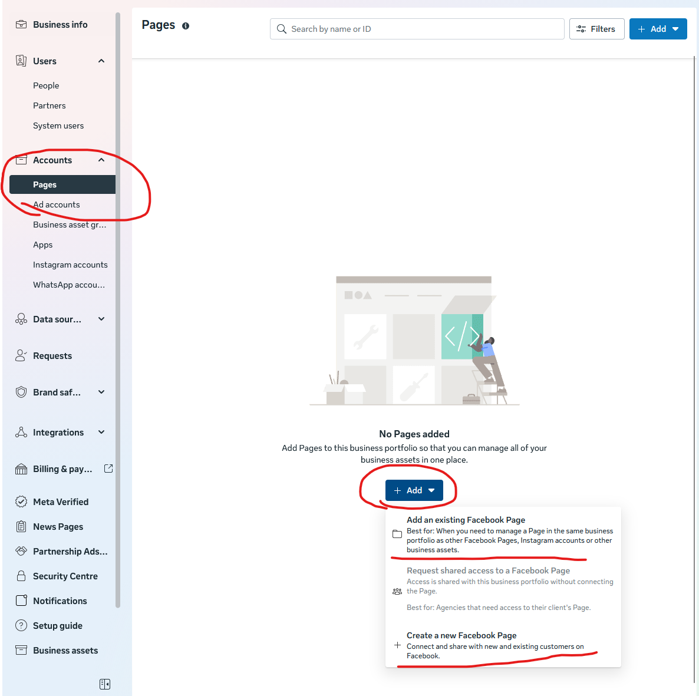
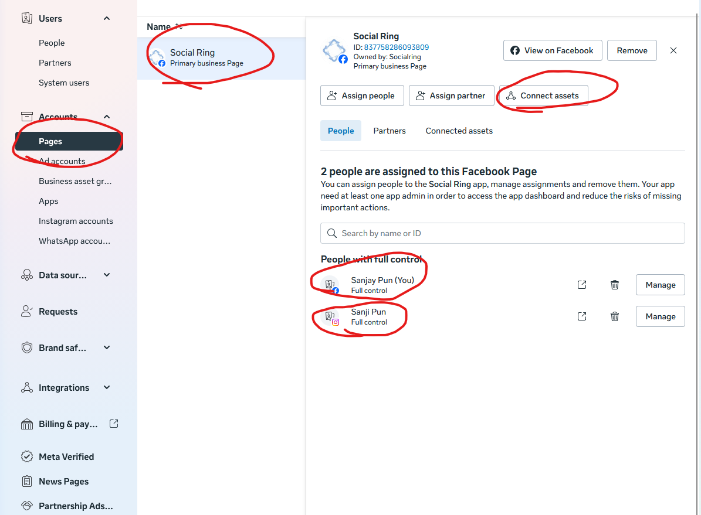
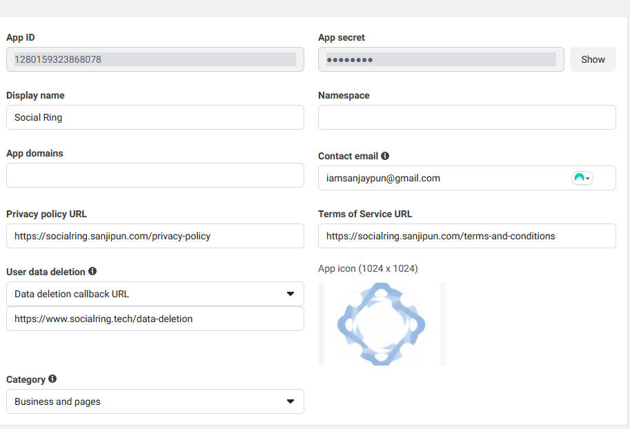
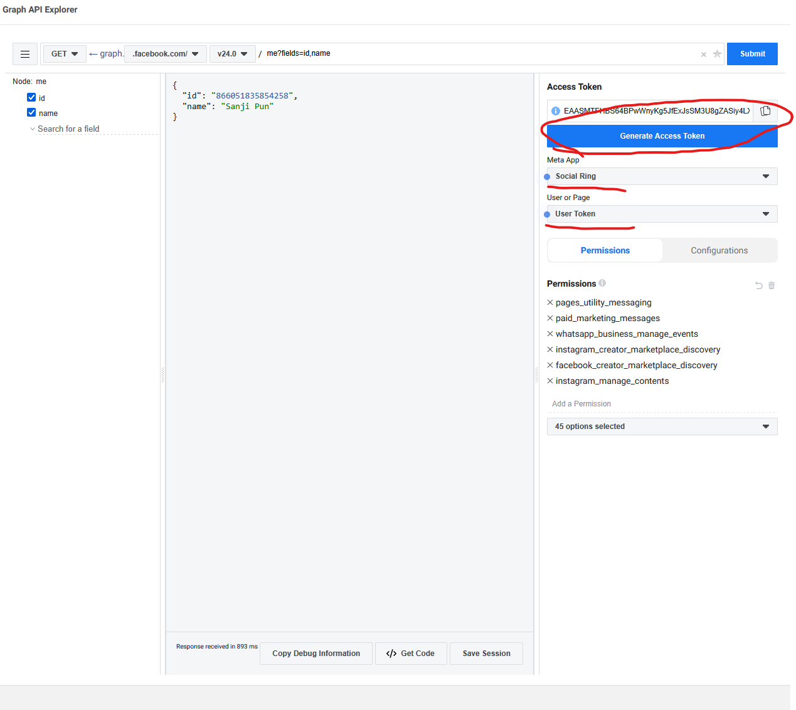
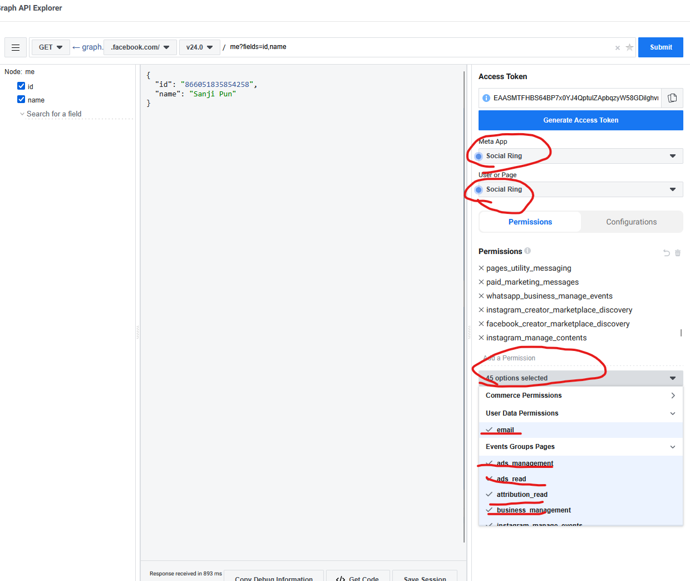

# Facebook & Instagram Setup Guide

## PART 1: Create Business Portfolio

This step creates a Meta Business Account to manage both Facebook Pages and Instagram Accounts.

1. Go to https://business.facebook.com and login to your account
2. On the left sidebar, click on your profile and select "Create a business portfolio"
3. Fill out the form with your business details and click "Create"
4. Click "Next", optionally add another person to manage the portfolio, then click "Confirm"
5. In the Home section, click "Go to Settings"
6. Click on "Instagram Accounts" and connect your Instagram account
7. On the left sidebar, go to "Accounts > Pages" and click "Add"
   
8. Choose to add an existing Facebook Page or create a new one
9. Search for the page name and click "Next"
10. Complete the setup process
11. On the Pages section, click "Connect Assets" and connect your Instagram account
    - Ensure both your Facebook Page and Instagram Account have full access permissions
    

---

## PART 2: Create Meta Developer App

This step sets up the developer app to authenticate and post to both Facebook and Instagram.

1. Go to https://developers.facebook.com/
2. Navigate to "My Apps" and click "Create an App"
3. Enter an App Name and contact email
4. In the "Use Cases" section, select "Others" and then "Other"
5. *(Note: Step 5 appears to be missing in the original guide)*
6. Click "Business" and then "Next"
7. Fill out the form and select the Business Portfolio you created in PART 1
8. Complete the process and select your newly created app from the dashboard
9. On the Dashboard, add "Set up app events" and "Facebook Login for Business"
10. In "Facebook Login for Business", enable "Login with JS SDK" and allow the domain for JS SDK (`https://localhost:3000/`)
11. Add Data Deletion request URL: `https://www.socialring.tech/data-deletion`
    - This is required for Meta compliance
12. In "App Settings" (bottom of page):
    - Add platform as "Website"
    - Add site URL as `http://localhost:3000/`
    - Save changes
    
13. Go to the [Graph API Explorer](https://developers.facebook.com/tools/explorer?method=GET&path=me%3Ffields%3Did%2Cname&version=v24.0)
14. Click "Generate Access Token" (this will prompt you to connect to Facebook)
15. On the right side, select your Meta app and choose "Page Access Token" (not User Token)
    
    
16. Click "Submit" to verify you can retrieve data
    - Save the Page Access Token for later use in the app

---

## Notes
- Use the **Page Access Token**, not User Access Token, for posting to pages
- Both Facebook and Instagram will use the same credentials
- The redirect URI for OAuth is: `http://localhost:3000/api/connect/fbig/`
- For production, update URLs from `localhost:3000` to your actual domain