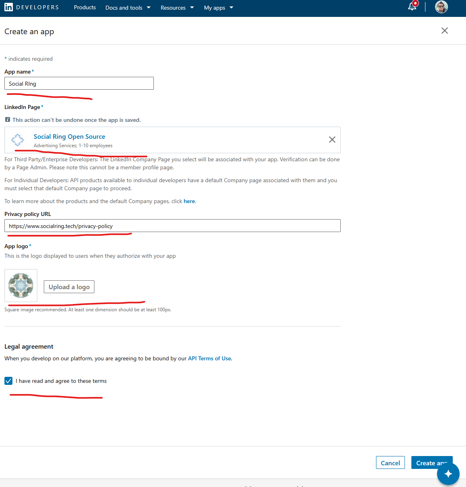
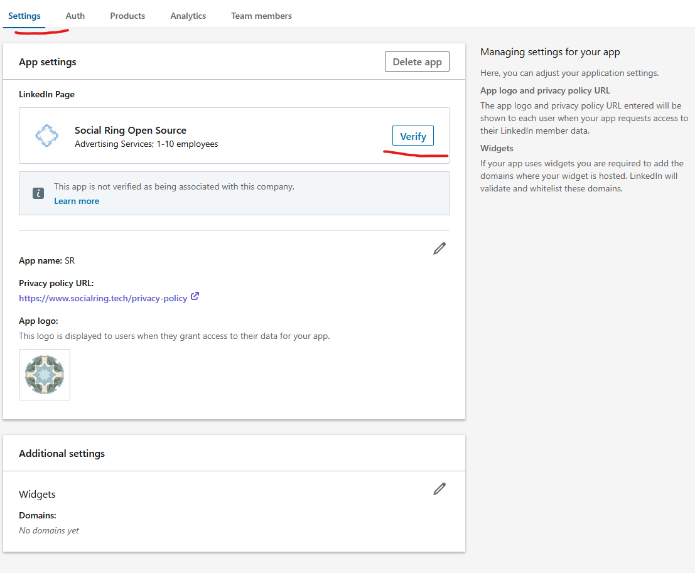
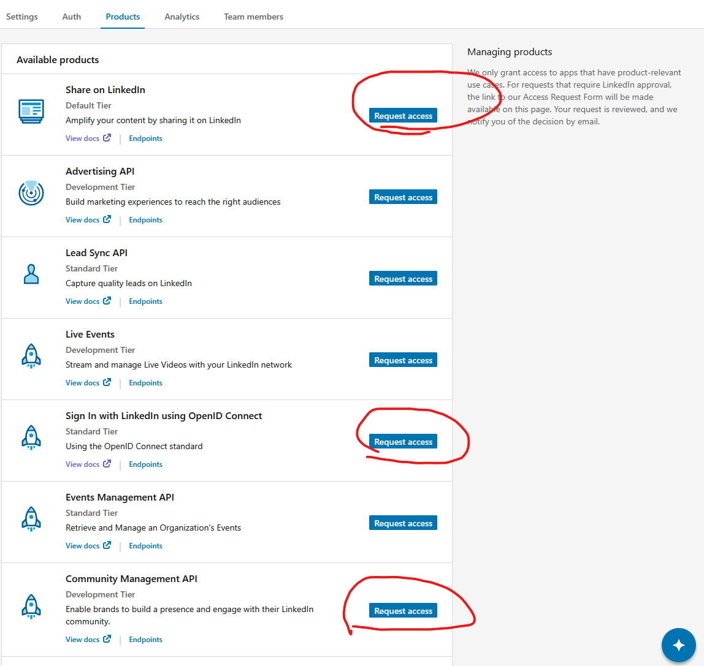
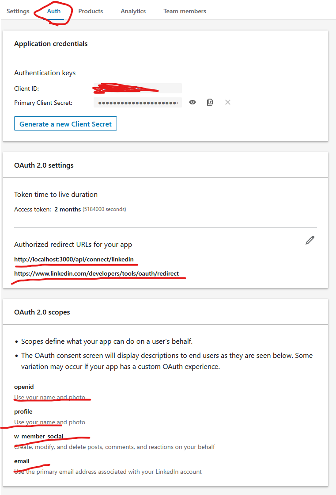

# LinkedIn Setup Guide

## PART 1: Create LinkedIn Presence

1. Create a LinkedIn Page from your personal LinkedIn account
   - This page will be used for publishing content
   - Ensure you are the admin/owner of this page

---

## PART 2: Create LinkedIn Developer App

2. Go to https://developer.linkedin.com/
3. Sign up for a developer account, then navigate to "My apps"
4. Fill out the form with:
   - Your Page name (the LinkedIn page you created above)
   - Your Organization name
   - Click "Create App"
   
   

---

## PART 3: Verify Business (CRITICAL STEP)

5. In the verification popup:
   - Click "Generate URL" and open it in a new tab
   - Click "Verify" to verify your business
   - Click "I'm done" when complete

6. **⚠️ IMPORTANT: Product Selection Order**
   - **You MUST select products in this exact order:**
   - First: Click on "Community Management API"
   - Second: Click on "Share on LinkedIn"
   - Third: Click on "Sign in with LinkedIn using OpenID Connect"
   
   
   **⚠️ WARNING:** If you select any other product first, you will NOT be able to access Community Management API
   - If this happens, you must delete this app and repeat steps 2-6

7. **⚠️ IMPORTANT: Community Management API is Required**
   - Without Community Management API, you can ONLY post to your personal profile and groups
   - You CANNOT post to business pages without this API
   - Ensure this API is enabled in your app permissions

---

## PART 4: Configure OAuth

8. Go to the "Auth" tab:
   - You will need your **Client ID** and **Client Secret** to connect accounts in the app

9. Add Authorized redirect URLs:
   - `http://localhost:3000/api/connect/linkedin/`
   - `https://www.linkedin.com/developers/tools/oauth/redirect`
   - For production, add your actual domain redirect URL
   

---

## Notes
- **DO NOT skip the verification step** - it's required for page access
- **Product selection order matters** - Community Management API must be selected first
- You cannot post to pages without Community Management API enabled
- Client ID and Client Secret are required for OAuth authentication
- Use your page ID for posting, not your personal profile ID