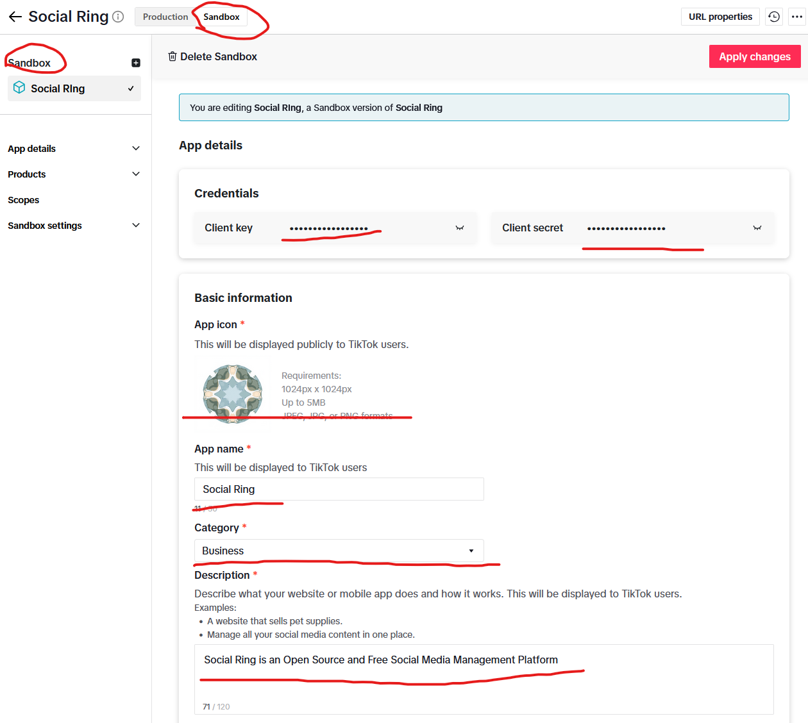
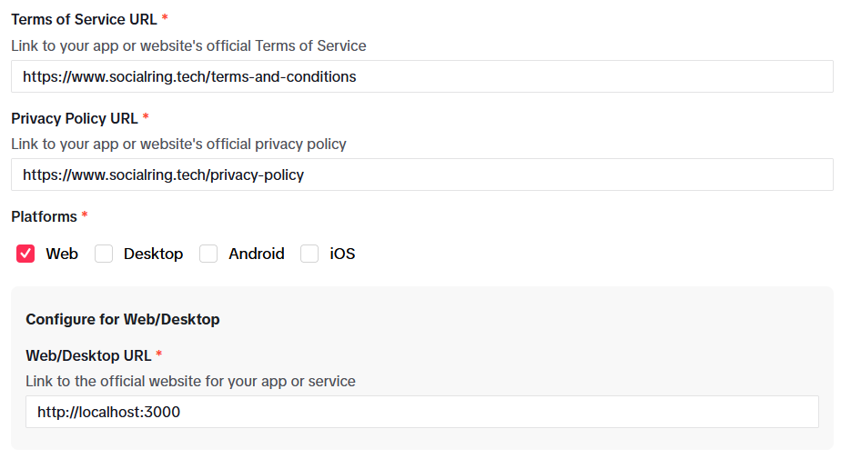
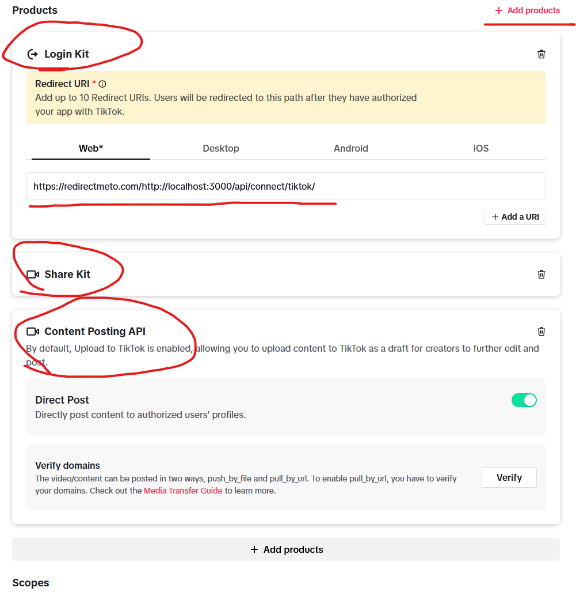
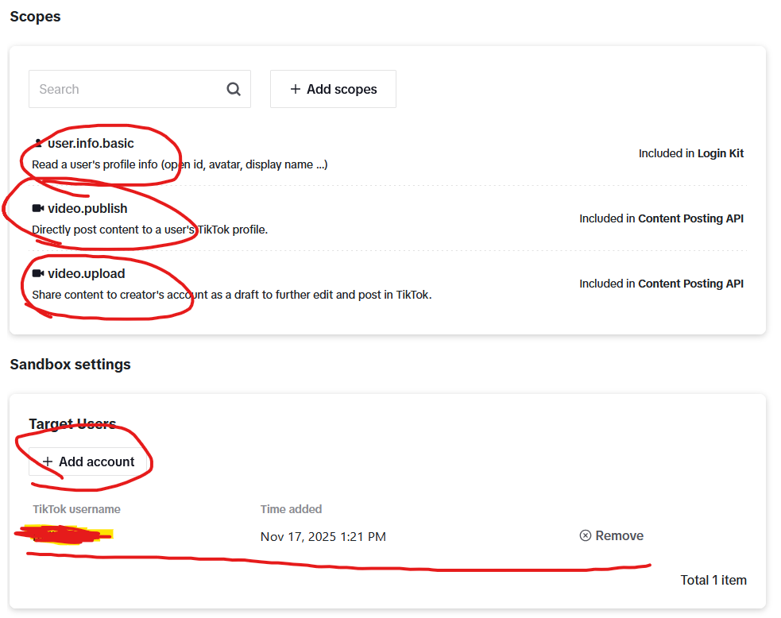

# TikTok Setup Guide

## PART 1: Create TikTok Developer App

1. Sign up for a developer account at https://developers.tiktok.com/
2. Go to https://developers.tiktok.com/apps and click "Connect an app"
3. Select Ownership type:
   - "Individual" (for personal use)
   - "Organization" (for business use)
4. Fill in:
   - App Name (descriptive name for your app)
   - App type: Select "Other" and then check the boxes for:
     - Login with TikTok
     - Share Kit
     - Content Posting API
   - Click "Create app"
5. **Important:** Ensure you are in the **Sandbox tab** (this is used for testing)
   
6. Click the eye icon to reveal:
   - **Client Key** (save this for later)
   - **Client Secret** (save this for later)

---

## PART 2: Complete App Information

7. Upload an App Icon (logo)
8. Re-enter App Name and select Category
9. Add a description for your app
10. Add Legal URLs:
    - Terms of Service URL: `https://www.socialring.tech/terms-and-conditions`
    - Privacy Policy URL: `https://www.socialring.tech/privacy-policy`
11. Configure Platform:
    - Select "Web" as the platform
    - Add Web URL: `http://localhost:3000/` (or your production domain)
    

---

## PART 3: Configure OAuth and Products

12. Click "Add Products" to enable features:
    - Select **Login Kit** (for OAuth authentication)
    - Select **Share Kit** (for sharing content)
    - Select **Content Posting API** (for posting videos)
    
    **⚠️ Important Limitation:**
    - Content Posting API posts are **PRIVATE by default** (SELF_ONLY)
    - Public posting is only available after TikTok verifies your business/organization
    - Verification link: https://developers.tiktok.com/application/content-posting-api

13. Add OAuth Redirect URL:
    - For local development (HTTP): `https://redirectmeto.com/http://localhost:3000/api/connect/tiktok/`
      - *(Note: TikTok requires HTTPS, so redirectmeto.com acts as a bridge for local testing)*
    - For production (HTTPS): `https://yourdomain.com/api/connect/tiktok/`
    
    **Alternative for local dev:** Use ngrok to create an HTTPS tunnel to `localhost:3000`

14. Your OAuth Scopes should automatically include:
    - `user.info.basic` (read profile)
    - `video.upload` (upload videos)
    - `video.publish` (publish videos)
    

---

## PART 4: Configure Target Accounts

15. In "Target Users" section:
    - Connect your TikTok account (this is the account where content will be posted)
    - This account must be in the same Sandbox environment
    

---

## Notes
- **Sandbox Mode:** Use for testing before going to production
- **Client Key and Client Secret:** Required for OAuth authentication
- **PKCE Required:** TikTok v2 API uses PKCE for security
- **HTTPS Required:** TikTok requires HTTPS redirect URIs (use ngrok for local dev)
- **Posts are Private:** Until your app is verified/audited by TikTok
- **Scopes Requested:** `user.info.basic,video.upload,video.publish`
- **Privacy Levels:** Posts default to `SELF_ONLY` (private) for unaudited apps
- **Database Storage:** Client Key, Client Secret, Access Token, Refresh Token, Open ID, Display Name, and Avatar URL are all saved