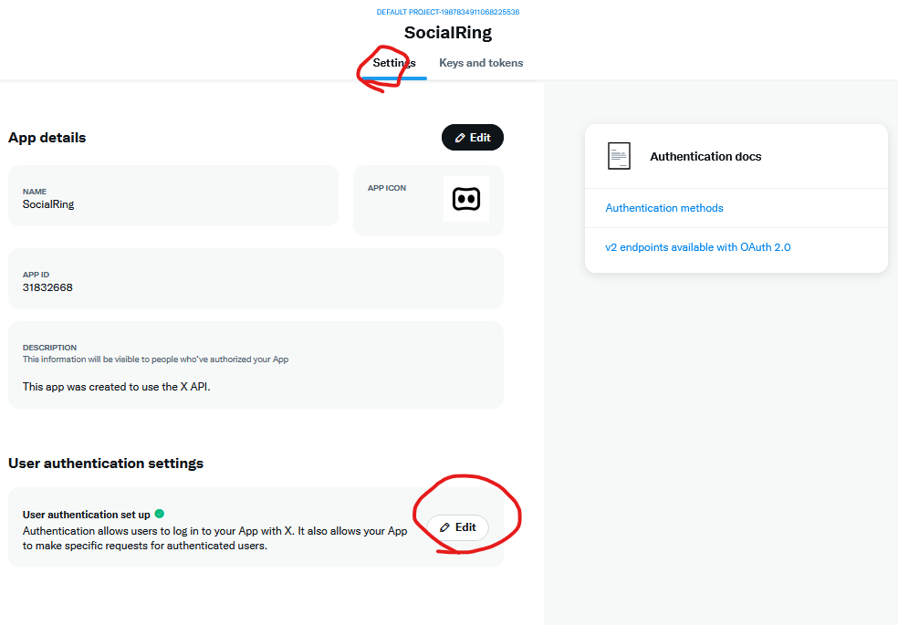
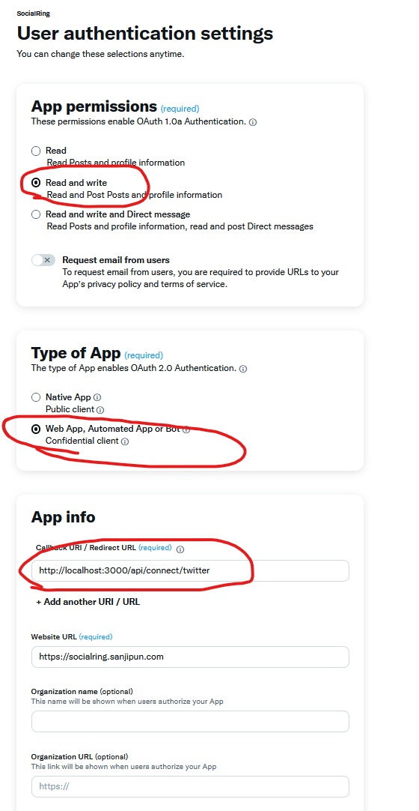

# X (Twitter) Setup Guide

## Create and Configure X Developer App

1. Go to https://developer.x.com/en
2. Create a Developer account and access the developer portal: https://developer.twitter.com/en/portal/dashboard
3. Navigate to "Projects & Apps" > "Default Project" > "Default project ID"
4. Go to the "Settings" tab and click on "User Authentication settings"
   - Click the "Set up" or "Edit" button to configure OAuth settings
5. In "App Permissions":
   - Select "Read and Write" (required for posting)
   - Select any other permissions you need for your use case
6. In "Type of App":
   - Select "Web App"
7. Set the OAuth Redirect URL (Callback URI):
   - Use: `http://localhost:3000/api/connect/twitter/`
   - For production, update to your actual domain
8. Click "Save" to apply settings
   
   
9. Go to the "Keys and tokens" tab:
   - Generate **Client ID** and **Client Secret**
   - These credentials are required to connect your Twitter account in the app
   - Keep these secure and do not share publicly

---

## Notes
- X (formerly Twitter) uses OAuth 2.0 with PKCE for authentication
- You must have "Read and Write" permissions to post tweets
- The redirect URL must exactly match what you configured in the developer portal
- For local development, use `http://localhost:3000/`
- For production, use your actual HTTPS domain